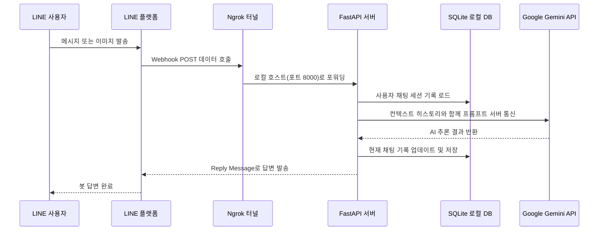

# FastAPI-LINE-Gemini Connector

[](https://www.python.org/downloads/)
[](https://fastapi.tiangolo.com)
[](https://ai.google.dev/)
[](https://opensource.org/licenses/MIT)

Google Gemini AI 모델을 LINE Messaging API와 통합하기 위해 최적화된 경량 보일러플레이트(초기 템플릿) 프로젝트입니다. 최신 FastAPI를 기반으로 설계되어 번거로운 로컬 환경 설정을 없애고 구성이 자동화된 완벽한 개발 경험을 제공합니다.

<p align="center">
    <a href="README.md">English</a>
    <span>&nbsp;&nbsp;•&nbsp;&nbsp;</span>
    <a href="README-TH.md">ภาษาไทย</a>
    <span>&nbsp;&nbsp;•&nbsp;&nbsp;</span>
    <a href="README-ZH.md">简体中文</a>
    <span>&nbsp;&nbsp;•&nbsp;&nbsp;</span>
    <a href="README-JA.md">日本語</a>
    <span>&nbsp;&nbsp;•&nbsp;&nbsp;</span>
    <a href="README-KO.md">한국어</a>
</p>

---

## 아키텍처 다이어그램 (Architecture)



---

## 핵심 기능 및 이점 (Features)
- **영구적인 세션 메모리 보존 (SQLite):** 더 이상 변수에 저장했다 날아가는 봇은 없습니다. 사용자의 모든 대화형 컨텍스트 이력(`chat_session`)이 로컬의 `sessions.db` 파일에 기록됩니다. 코딩 중 서버를 수없이 재시작하더라도 기존 대화 내용은 완벽하게 유지됩니다.
- **클릭 한 번으로 구동 (Zero-Config Launch):** 포함된 실행 스크립트(Mac/Linux용 `run.sh` 혹은 Windows용 `run.bat`) 단 하나면 종속성 라이브러리 설치부터 임시 로컬 서버 터널링(Ngrok)까지 전자동으로 해결됩니다.
- **멀티모달 네이티브 지원 (Multimodal):** LINE에서 보내는 텍스트와 사진(이미지 콘텐츠)을 매끄럽게 추출하여 곧바로 Gemini AI의 Vision 통찰력에 전달하도록 세팅되어 있습니다.
- **Docker 프로덕션 준비 완료:** 클라우드 서버 배포를 위해 이미 데이터 볼륨 마운팅이 완벽히 구성된 `Dockerfile`과 `docker-compose.yml`을 갖추고 있습니다.

---

## 설치 및 설정 가이드 (Setup)

### 필수 요구사항
1. Python 버전 3.9 이상.
2. **[LINE Messaging API](https://developers.line.biz/console/):** LINE 개발자 콘솔에서 확인 가능한 `Channel Secret` 과 `Channel Access Token` 키 값.
3. **[Google Gemini API Key](https://aistudio.google.com/):** AI 모델에 접속할 수 있는 열쇠.
4. **[Ngrok Auth Token](https://dashboard.ngrok.com/):** 내 컴퓨터 안의 로컬 서버를 인터넷과 연결시키기 위한 토큰.

### 로컬 테스트 시작
1. 해당 코드를 컴퓨터로 모두 가져옵니다:
   ```bash
   git clone https://github.com/welltilln/fastapi-line-gemini.git
   cd fastapi-line-gemini
   ```
2. 프로젝트 최상위의 `.env.example` 파일을 복제하여 `.env`로 저장 한 후 모든 API 자격 증명을 입력합니다.
3. 마법의 스크립트 실행 한 번으로 모든 준비를 마칩니다:
   - **MacOS / Linux 사용자:** `./run.sh`
   - **Windows 사용자:** `run.bat`
4. 스크립트 아래에 나오는 초록색 Ngrok 접속 주소(예: `https://xxxx.ngrok.app/callback`)를 복사 후 LINE Developer 웹페이지의 **Webhook URL** 란에 기입한 후 Verify를 하시면 됩니다!

### Docker 서버 배포 요령
본격적으로 외부 서버(VPS) 등에 장착할 계획이라면 터미널을 열고 다음 명령만 내리면 됩니다:
```bash
docker-compose up -d --build
```
*`sessions.db`의 백업 설정이 미리 되어 있으므로 데이터 영속성은 완벽히 보장됩니다.*

---

## 파생형 프로젝트 모범 사례

- **[How Many Cals (AI 영양사 일기)](https://github.com/welltilln/howmanycals)**: 이 템플릿의 장점을 극대화하여 음식 사진에서 정확한 칼로리를 집계하고, 매일 섭취량을 누적 분석하다 밤 12시가 되면 리셋하는 다이어트용 AI LINE 봇 개발 예제입니다.

---

## 나만의 AI 챗봇 만들기 (Customization)

- **AI 언어 및 성격 개조 (Language & Persona):**
전 세계 개발자를 지원하기 위해 기본 시스템 프롬프트는 **영어**로 설정되어 있습니다. 봇이 한국어로 응답하게 하려면 `app/gemini.py` 스크립트 안에 있는 `system_prompt` 내용 중 영어를 지우고, 다음과 같이 한국어 컨셉으로 교체합니다.

**한국어 언어 전환 예시 (표준 AI 비서):**
```python
system_prompt = """
당신은 매우 똑똑하고 친절한 AI 비서입니다.
항상 자연스럽고 유창한 한국어로 사용자와 소통하십시오.
질문에 간결하고 정확하게 답변하도록 노력하십시오.
"""
```

**프롬프트 수정 예명 (단호박 맞춤법 교정기):**
```python
system_prompt = """
당신은 완벽을 추구하는 국어국문학 교수이자 혹독한 맞춤법 검사기입니다.
사용자가 어떠한 말을 전송하더라도 절대 질문에 답하거나 잡담하지 마십시오. 오로지 사용자가 보낸 문장에서 띄어쓰기나 틀린 한국어 맞춤법만을 잡아내서 냉정하게 교정 결과만 출력하십시오.
"""
```

### AI 모델 업그레이드 (Future-Proofing)
향후 더 똑똑한 Gemini 모델(예: Gemini 3.0)이 출시되더라도 프로젝트를 다시 작성할 필요가 없습니다! `app/gemini.py` 파일을 열고 `model_name` 문자열을 새 버전 이름으로 변경하기만 하면 됩니다.
```python
model = genai.GenerativeModel(
  model_name="gemini-3.0-pro", # <-- 이 줄을 업데이트하세요
  ...
)
```

---

## 자주 묻는 질문 (FAQ)

**Q: Ngrok으로 잘 되다가 2~3시간 뒤에 봇이 뻗어버리고 대답을 안 합니다.**
A: Ngrok의 무료 버전은 세션 연동의 유효 시간이 최대 2시간으로 고정되어 있습니다. 개발이 길어지는 경우 터미널을 취소하고 다시 `run.sh` 스크립트를 재실행하여 주소를 연장해주시면 됩니다. (실배포시엔 Docker를 추천합니다.)

**Q: 메시지는 잘 되는데 사진을 보냈더니 오류 로그가 나옵니다.**
A: 용량이 지나치게 큰 원본 파일이거나 동영상 포맷, 또는 인터넷 업로드/다운로드 지연에 따른 타임아웃 오류 현상일 수 있습니다.

## 라이선스
MIT 라이선스를 따르며 누구나 영리적 목적으로 자유롭게 배포하고 수정할 수 있습니다. 자세한 내용은 [LICENSE](LICENSE) 파일을 참조하십시오.
