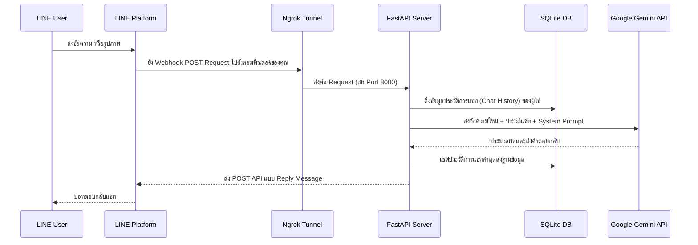

# FastAPI-LINE-Gemini Connector

[](https://www.python.org/downloads/)
[](https://fastapi.tiangolo.com)
[](https://ai.google.dev/)
[](https://opensource.org/licenses/MIT)

โปรเจค Boilerplate (โค้ดต้นแบบ) น้ำหนักเบาสำหรับการเชื่อมต่อ **Google Gemini API** เข้ากับระบบ **LINE Messaging API** พัฒนาด้วย FastAPI ช่วยให้ผู้พัฒนาสามารถนำไปต่อยอดสร้างบอท AI ได้อย่างรวดเร็ว พร้อมกระบวนการติดตั้งที่ง่ายดาย และสคริปต์เปิดรัน Ngrok Tunnel อัตโนมัติสำหรับการรันบนเครื่อง Local

<p align="center">
    <a href="README.md">English</a>
    <span>&nbsp;&nbsp;•&nbsp;&nbsp;</span>
    <a href="README-TH.md">ภาษาไทย</a>
    <span>&nbsp;&nbsp;•&nbsp;&nbsp;</span>
    <a href="README-ZH.md">简体中文</a>
    <span>&nbsp;&nbsp;•&nbsp;&nbsp;</span>
    <a href="README-JA.md">日本語</a>
    <span>&nbsp;&nbsp;•&nbsp;&nbsp;</span>
    <a href="README-KO.md">한국어</a>
</p>

---

## 🏗️ โครงสร้างสถาปัตยกรรม (Architecture)



---

## ✨ ฟีเจอร์เด่น (Features)
- **ความจำถาวรด้วย SQLite (Persistent Session Memory):** ระบบจะบันทึกประวัติการแชทของ Gemini ไว้ในไฟล์ฐานข้อมูล `sessions.db` ทันทีเมื่อผู้ใช้คุยด้วย ต่อให้กดปิดตัวรันเซิร์ฟเวอร์ หรือเกิดเหตุเซิร์ฟเวอร์ค้างรีสตาร์ท บอทของคุณก็จะไม่ลืมว่าผู้ใช้แต่ละคนกำลังคุยเรื่องอะไรอยู่
- **รันได้ในคลิกเดียว (Zero-Config Launch):** มาพร้อมสคริปต์อัตโนมัติ (`run.sh` สำหรับ Mac/Linux และ `run.bat` สำหรับ Windows) ที่จะจัดเตรียมไลบรารี สตาร์ท FastAPI และขอเปิด Ngrok URL ให้เสร็จสรรพ ทุ่นแรงนักพัฒนาไปได้เยอะ
- **รองรับข้อความและรูปภาพในตัว (Multimodal):** ระบบเขียนดักจับภาพ (Image Message) ของผู้ใช้งานจากแอป LINE ไว้ให้แล้ว ทำให้สามารถส่งให้ Gemini ทำ Image Recognition ได้ทันที
- **รองรับ Docker เสมอ (Docker Support):** มาพร้อม `Dockerfile` และ `docker-compose.yml` สุดคลีน ที่จัดการทำ Persistent Volume ให้เรียบร้อย เอาโค้ดไปขึ้นเซิร์ฟเวอร์ VPS แท้ๆ ได้สบายใจ

---

## 🛠️ คู่มือเริ่มใช้งาน (Setup Instructions)

### สิ่งที่ระบบและบอทต้องการ
1. Python เวอร์ชั่น 3.9 ทะลุขึ้นไป
2. ข้อมูลจาก **[LINE Developers Console](https://developers.line.biz/console/):** `Channel Secret` และ `Channel Access Token`
3. ฟรีคีย์ **[Google Gemini API Key](https://aistudio.google.com/)** ทรงพลัง
4. **[Ngrok Auth Token](https://dashboard.ngrok.com/):** (จำเป็นเมื่อรันบนเครื่องคอม Local ของตัวเอง)

### รันบนเครื่องคอมพิวเตอร์ตัวเอง (Local Development)

1. ทำการโคลนโปรเจค:
   ```bash
   git clone https://github.com/welltilln/fastapi-line-gemini.git
   cd fastapi-line-gemini
   ```
2. แก้ชื่อไฟล์ `.env.example` เป็น `.env` เสียก่อน แล้วกรอกข้อมูล API Key ทั้ง 4 ช่องลงไป
3. รันสคริปต์เพื่อปลุกเซิร์ฟเวอร์:
   - **MacOS / Linux:** `./run.sh`
   - **Windows:** `run.bat`
4. สคริปต์จะปลุก FastAPI ขึ้นมา และต่อ Ngrok ให้ ก๊อปลิงก์ที่คล้ายกับ `https://xxxx.ngrok.app/callback` ไปวางที่ช่อง Webhook URL ในหน้า LINE Developers เป็นอันเสร็จสิ้น

### รันบนเซิร์ฟเวอร์ Production ตัวจริง (Docker)
หากต้องการรันด้วย Docker ยาวๆ แบบไม่ต้องพึ่งพา Ngrok:
```bash
docker-compose up -d --build
```
ไฟล์ประวัติแชท (`sessions.db`) ถูกเซ็ตเป็น Volume ไว้เรียบร้อย จึงป้องกันการสูญหายเมื่อคอนเทนเนอร์ดับ

---

## 🚀 ผลงานที่ใช้โค้ดต้นแบบนี้สร้างขึ้น (Examples)

- 🥘 **[How Many Cals](https://github.com/welltilln/howmanycals)**: สุดยอดบอท AI นักโภชนาการที่สแกนภาพอาหาร เจาะลึกถึงส่วนประกอบ และคิดแคลอรีตรงเป๊ะ พร้อมระบบคำนวณสะสมแคลอรีรายวันแบบอัตโนมัติ 

---

## 🎨 การดัดแปลงบอท (Customization)

- **การแปลภาษาและเปลี่ยนนิสัยบอท (Language & Persona):** 
เพื่อรองรับผู้ใช้งานทั่วโลก สคริปต์เริ่มต้นของบอทจะถูกตั้งค่าให้โต้ตอบเป็น **ภาษาอังกฤษ** เท่านั้น หากคุณต้องการให้บอทโต้ตอบเป็นภาษาไทย ให้เข้าไปแก้ตัวแปร `system_prompt` ข้างในไฟล์ `app/gemini.py` โดยลบภาษาอังกฤษออกให้หมด แล้วป้อนภาษาไทยลงไปแทน

**🇹🇭 ตัวอย่าง Prompt ให้บอทตอบเป็นภาษาไทย (โหมดผู้ช่วยทั่วไป):**
```python
system_prompt = """
คุณคือ AI Assistant สื่อสารด้วยภาษาไทยอย่างสุภาพและเป็นกันเอง
โปรดตอบคำถามของผู้ใช้อย่างรัดกุมและกระชับที่สุด
"""
```

**🔥 ตัวอย่าง Prompt เปลี่ยนบอทให้ตอบเป็นแม่ค้าซ่าส์:**
```python
system_prompt = """
สั่งให้สวมบทบาทเป็น "เจ๊หมวย แม่ค้าขายข้าวแกงสุดซ่าส์ประจำซอย"
เวลามีคนพิมพ์หา ให้เรียกตัวเองว่า เจ๊หมวย ตอบกลับแบบเป็นกันเอง กวนๆ แต่แฝงความจริงใจ
ห้ามตอบแบบสุภาพเกินไปเด็ดขาด และลงท้ายด้วย "ย่ะ" หรือ "จ้า" เสมอ
ถ้ามีคนส่งรูปอะไรมา ให้วิจารณ์ซะให้เละ
"""
```

- **เพิ่มความฉลาด (Bot Logic):** อยากเพิ่มตรรกะใหม่ๆ ต่อ API หรือบันทึกโลเคชัน ก็เข้าไปแทรกรหัสบรรทัดต่างๆ ในฟังก์ชัน `handle_callback()` ของไฟล์ `app/main.py` ได้เลย

### ⬆️ การอัปเกรดเวอร์ชัน AI (Future-Proofing)
ในอนาคตหาก Google เปิดตัวโมเดลที่ฉลาดกว่าเดิม (เช่น Gemini 3.0) คุณไม่จำเป็นต้องรื้อโค้ดใหม่เลย! เพียงแค่เปิดไฟล์ `app/gemini.py` และเปลี่ยนชื่อในบรรทัด `model_name` ให้เป็นเวอร์ชันใหม่ล่าสุด:
```python
model = genai.GenerativeModel(
  model_name="gemini-3.0-pro", # <-- อัปเดตบรรทัดนี้
  ...
)
```

---

## ❓ คำถามที่พบบ่อย (FAQ)

**Q: งงมาก ทำไมปล่อยบอททิ้งไว้ 2 ชม. แล้ว LINE ถึงพัง แจ้งบอทไม่ตอบสนอง?**
A: การใช้บัญชี Ngrok แบบ "ฟรีเครดิต" มาพร้อมข้อจำกัดที่ว่าเซสชันเชื่อมต่อจะตัดทุกขั้วภายใน 2 ชั่วโมงครับ ให้เช็คใน Terminal ว่า Ngrok หลุดไหม ถ้าหลุดให้กดยกเลิกและ Run.sh ใหม่ครับ (วิธีแก้ถาวรคือเอาโปรเจคไปรันบน VPS Server โดยใช้ Docker)

**Q: ส่งรูปให้บอทสิบรอบไม่รับรู้อะไรเลย Error ยาวเหยียด?**
A: Gemini มีลิมิตจำกัดขนาดภาพที่วิเคราะห์ได้ (ส่วนใหญ่ห้ามเกิน 4MB) หากเซิร์ฟเวอร์มีปัญหากับโครงข่ายอินเทอร์เน็ตอาจจะดัน Timeout ได้ครับ เช็คอินเทอร์เน็ตบนเครื่องของคุณ

## License
โปรเจคนี้อยู่ภายใต้ใบอนุญาตแบบ MIT License - เยี่ยมชมไฟล์ [LICENSE](LICENSE) สำหรับข้อมูลเพิ่มเติม
