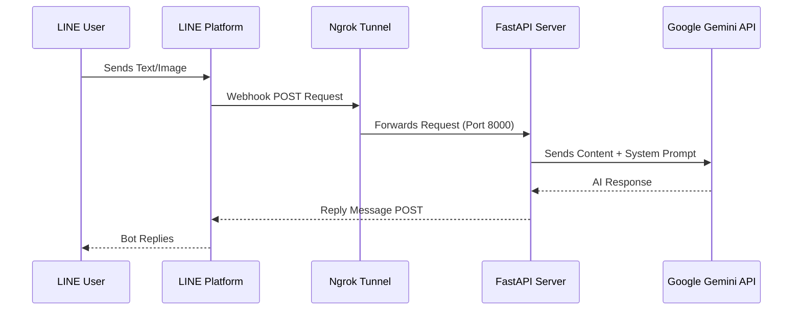

# 🤖 FastAPI-LINE-Gemini Connector (Zero-Friction Template)

[](https://www.python.org/downloads/)
[](https://fastapi.tiangolo.com)
[](https://ai.google.dev/)
[](https://opensource.org/licenses/MIT)

A **plug-and-play boilerplate** to connect Google's Gemini AI directly to your LINE Official Account. 
Built with FastAPI, this template features a **"Zero-Friction" setup**—it automatically launches a local server and an Ngrok tunnel in a single click, perfectly suited for rapid prototyping, assignments, or portfolio building!

---

## 🏗️ Architecture Flow



---

## ✨ Key Features
- **🚀 1-Click Launch**: `run.sh` / `run.bat` automatically creates an isolated virtual environment, installs packages, and launches both your backend and Ngrok tunnel!
- **🧠 Native AI Memory**: Employs Gemini's `chat_session` to remember conversational context for intelligent bot interactions.
- **📸 Vision Support**: Ready out-of-the-box to process and analyze images sent from LINE.
- **🎭 Customizable Persona**: Want a sassy assistant or a professional tutor? Just edit the `system_prompt` in one file!

---

## 🛠️ Prerequisites
Before starting, make sure you have the following ready:
1. **[Python 3.9+](https://www.python.org/downloads/)** installed on your machine.
2. **LINE Messaging API Keys** ([LINE Developers Console](https://developers.line.biz/console/)): You need the `Channel Secret` and `Channel Access Token`.
3. **Google Gemini API Key** ([Google AI Studio](https://aistudio.google.com/)).
4. **Ngrok Auth Token** ([Ngrok Dashboard](https://dashboard.ngrok.com/)): Required for the tunnel to bypass your router and expose the bot to LINE.

---

## ⚡ Quick Start (The Magic Way)

1. **Clone or Download** this repository to your computer.
2. Rename `.env.example` to `.env`.
3. Open `.env` and fill in your API keys:
   ```env
   GEMINI_API_KEY=your_gemini_api_key_here
   LINE_CHANNEL_SECRET=your_line_channel_secret_here
   LINE_CHANNEL_ACCESS_TOKEN=your_line_channel_access_token_here
   NGROK_AUTHTOKEN=your_ngrok_authtoken_here
   ```
4. Double-click or run the setup script for your OS:
   - **MacOS / Linux:** Run `./run.sh` in your terminal.
   - **Windows:** Double-click `run.bat`.

> **That's it!** The script handles all the tedious `pip install` and `venv` stuff.
> Wait for the terminal to print your magical Webhook URL (e.g., `https://xxxx.ngrok.app/callback`).

5. Paste that Webhook URL into your **LINE Developers Console** and hit **Verify**.

---

## 🐳 Enterprise Deployment (Docker)

For 24/7 production use, it is highly recommended to run this project securely on a cloud VPS (e.g., AWS, DigitalOcean) via Docker without ngrok.

1. Install [Docker](https://docs.docker.com/get-docker/) & [Docker Compose](https://docs.docker.com/compose/).
2. Run the following command in the terminal:
   ```bash
   docker-compose up -d --build
   ```
3. The server will run in the background. Stop it anytime with `docker-compose down`.

---

## ⚙️ How to Customize Your Bot

This template is designed to be easily modified without fighting the boilerplate:

- **Change Bot Personality:**
  Open `gemini.py` and modify the `system_prompt` string. Give it rules, a persona, or specific output formats.

- **Change Bot Behavior (Advanced):**
  Open `main.py` and scroll down to `handle_callback()`. Here you can add custom logic for specific text commands before sending them to Gemini.

---

## 🤝 Contribution & Forking
Feel free to fork this repository and build your own awesome LINE bots! If you create something cool, don't hesitate to share. 

*Built with ❤️ for rapid prototyping.*
