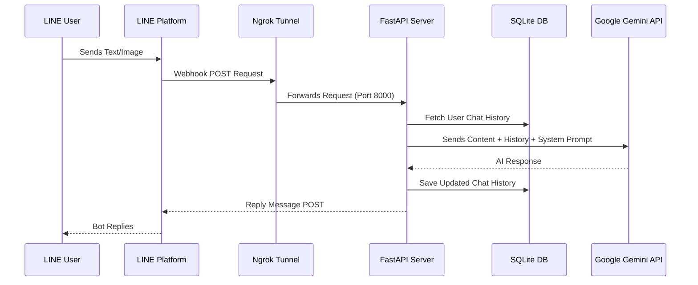

# FastAPI-LINE-Gemini Connector

[](https://www.python.org/downloads/)
[](https://fastapi.tiangolo.com)
[](https://ai.google.dev/)
[](https://opensource.org/licenses/MIT)

A lightweight boilerplate repository for integrating Google's Gemini API with the LINE Messaging API. Built on FastAPI, this project provides a streamlined setup process, including an automated local Ngrok tunnel for rapid prototyping.

<p align="center">
    <a href="README.md">English</a>
    <span>&nbsp;&nbsp;•&nbsp;&nbsp;</span>
    <a href="README-TH.md">ภาษาไทย</a>
    <span>&nbsp;&nbsp;•&nbsp;&nbsp;</span>
    <a href="README-ZH.md">简体中文</a>
    <span>&nbsp;&nbsp;•&nbsp;&nbsp;</span>
    <a href="README-JA.md">日本語</a>
    <span>&nbsp;&nbsp;•&nbsp;&nbsp;</span>
    <a href="README-KO.md">한국어</a>
</p>

## Architecture



## Features
- **Persistent Session Memory (SQLite)**: Automatically saves and restores Gemini chat histories (`chat_session`) per user in a local `sessions.db`. Server restarts will *not* wipe conversational context.
- **Zero-Configuration Launch**: Execution scripts (`run.sh` / `run.bat`) automatically manage virtual environments, dependencies, and local tunneling (Ngrok).
- **Multimodal Support**: Built-in handling for both text messages and image parsing.
- **Docker Support**: Includes a `Dockerfile` and `docker-compose.yml` for isolated production deployments.

## Prerequisites
1. Python 3.9 or higher.
2. [LINE Messaging API Credentials](https://developers.line.biz/console/): `Channel Secret` and `Channel Access Token`.
3. [Google Gemini API Key](https://aistudio.google.com/).
4. [Ngrok Auth Token](https://dashboard.ngrok.com/): Required for local development.

## Setup Instructions

### Local Development

1. Clone the repository.
2. Rename `.env.example` to `.env` and assign your API credentials.
3. Execute the startup script appropriate for your operating system:
   - **MacOS / Linux:** `./run.sh`
   - **Windows:** `run.bat`

The script will launch the FastAPI server and expose it via Ngrok. 
Copy the generated Webhook URL (e.g., `https://xxxx.ngrok.app/callback`) and configure it in your LINE Developers Console.

## Built with this Template (Examples)

Check out what you can build using this template:
- 🥘 **[How Many Cals](https://github.com/welltilln/howmanycals)**: An AI-powered LINE bot that analyzes food images, extracts exact calorie counts, reads meal components, and tracks daily calorie intake using Gemini's native session memory.

### Production Deployment (Docker)

For stable, long-term hosting on a traditional VPS without Ngrok, utilize the provided Docker configuration.

1. Ensure [Docker](https://docs.docker.com/get-docker/) & [Docker Compose](https://docs.docker.com/compose/) are installed.
2. Build and run the container in detached mode:
   ```bash
   docker-compose up -d --build
   ```

## Customization

- **AI Persona**: Modify the `system_prompt` variable within `gemini.py` to adjust the model's behavior and personality.
- **Bot Logic**: Custom routing or pre-processing logic can be added to the `handle_callback()` function in `main.py`.

### ⬆️ Upgrading the AI Model (Future-Proofing)
If a newer, smarter Gemini model is released in the future (e.g., Gemini 3.0), you don't need to rewrite the project! Simply open `app/gemini.py` and change the `model_name` string to the new version:
```python
model = genai.GenerativeModel(
  model_name="gemini-3.0-pro", # <-- UPDATE THIS LINE
  ...
)
```

## License

This project is licensed under the MIT License - see the [LICENSE](LICENSE) file for details.
