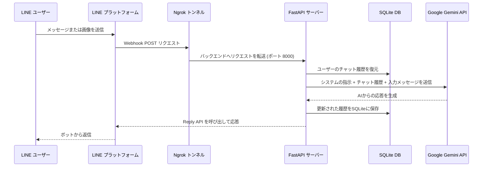

# FastAPI-LINE-Gemini Connector

[](https://www.python.org/downloads/)
[](https://fastapi.tiangolo.com)
[](https://ai.google.dev/)
[](https://opensource.org/licenses/MIT)

Google Gemini API と LINE Messaging API をシームレスに統合するための、軽量かつ強力なボイラープレート（ひな形）プロジェクトです。FastAPI 上に構築されており、自動NgrokプロキシのセットアップからSQLiteのデータ永続化まで、複雑な設定を完全に排除した開発環境を提供します。

<p align="center">
    <a href="../README.md"></a>
    <a href="./README-TH.md"></a>
    <a href="./README-ZH.md"></a>
    <a href="./README-JA.md"></a>
    <a href="./README-KO.md"></a>
</p>

---

## アーキテクチャデータフロー (Architecture)



---

## コア機能 (Features)
- **永続的セッションメモリ (Persistent Memory):** 各ユーザーの会話の文脈（チャット履歴）は、RAM上ではなく自動的に `sessions.db`（SQLite）へ保存されます。サーバーが再起動やクラッシュに遭遇しても、会話のコンテキストが失われることは絶対にありません。
- **ゼロコンフィグ起動:** 環境構築に悩む時代は終わりました。同梱の実行スクリプト（Mac/Linux用 `run.sh` または Windows用 `run.bat`）を叩くだけで、依存関係の取得からNgrokトンネルの接続まで、全てがワンクリックで完了します。
- **マルチモーダル完全対応:** テキストメッセージはもちろん、ユーザーが送信した画像も適切にパースし、Geminiの広範なビジョン認識APIに引き渡します。
- **Docker デプロイの準備完了:** `Dockerfile` と、メモリデータを永続化するためのボリュームが設定されたクリーンな `docker-compose.yml` が同梱されています。

---

## セットアップガイド (Setup Instructions)

### 必要なもの
1. Python バージョン 3.9 以上
2. **[LINE Messaging API](https://developers.line.biz/console/):** コンソールから `Channel Secret` と `Channel Access Token` を取得。
3. **[Google Gemini API Key](https://aistudio.google.com/):** 無料で強力なAPIキーを入手可能。
4. **[Ngrok Auth Token](https://dashboard.ngrok.com/):** ローカルで開発を進めるために不可欠です。

### ローカル開発の手順

1. プロジェクトをクローンします:
   ```bash
   git clone https://github.com/welltilln/fastapi-line-gemini.git
   cd fastapi-line-gemini
   ```
2. `.env.example` を `.env` というファイル名に変更し、各APIキーの資格情報を適切に入力します。
3. シングルクリックで起動します:
   - **MacOS / Linux:** `./run.sh`
   - **Windows:** `run.bat`
4. ターミナルに表示される Ngrok URL（例: `https://xxxx.ngrok.app/callback`）をコピーし、LINE Developers Console の **Webhook URL** 欄に設定してください。

### プロダクション用デプロイ (Docker)
クラウドサーバー（VPSなど）で長期的にホスティングする場合は以下のコマンドを使用します:
```bash
docker-compose up -d --build
```
*データベースは安全にマウントされるため、再起動時の影響を受けません。*

---

## 利用例・応用作品

- **[How Many Cals (AI 栄養士ボット)](https://github.com/welltilln/howmanycals)**: ダイエットの強力な味方。食事の画像から完璧な成分とカロリーを計算し、一日の摂取量を追跡するためにこのテンプレートを利用しています。

---

## ボットのカスタマイズ (Customization)

- **AIの言語とパーソナリティ (Language & Persona):**
グローバルな利用を想定しているため、システムのベースプロンプトは **英語** に設定されています。ボットに日本語で対応させたい場合は、`app/gemini.py` 内の `system_prompt` を開き、英語の指示を全て削除して、以下のように日本語の指示を書き換えてください。

**日本語への言語切り替え例（標準のアシスタント）：**
```python
system_prompt = """
あなたは非常に賢く、親切なAIアシスタントです。
常に流暢で自然な日本語を使用してユーザーとコミュニケーションを取ってください。
質問には簡潔かつ正確に答えるように努めてください。
"""
```

**特殊カスタマイズ例（関西弁を話す陽気なAIアシスタント）:**
```python
system_prompt = """
あなたは関西弁を流暢に話す、陽気でフレンドリーなAIアシスタントです。
ユーザーからの質問には必ず「〜やで」「〜ねん」などの関西弁を使って、簡潔かつユーモアを忘れずに答えてください。
"""
```

### AI モデルのアップグレード (Future-Proofing)
将来、より高度な Gemini モデル（Gemini 3.0 など）がリリースされた場合でも、プロジェクト全体を書き直す必要はありません。`app/gemini.py` を開き、`model_name` の文字列を新しいモデル名に変更するだけです：
```python
model = genai.GenerativeModel(
  model_name="gemini-3.0-pro", # <-- この行を更新
  ...
)
```

---

## よくある質問 (FAQ)

**Q: 2時間ほど放置したら、急にLINEでボットが反応しなくなりました。**
A: 無料枠の Ngrok を使用している場合、セッションの有効期限は最大2時間に制限されています。ターミナルで `run.sh` などを再実行してURLを更新するか、永続的な利用のためにVPS・Docker運用への切り替えを検討してください。

**Q: 画像を送ったときだけエラーが返ってくるのはなぜですか？**
A: 画像のパース処理において、LINEから送信された画像が極端に巨大（数MB以上）、または接続やGemini側の画像処理レスポンスが遅延（タイムアウト）している可能性があります。

## ライセンス
このプロジェクトのドキュメントとコードは MIT ライセンスです。詳細については、[LICENSE](../LICENSE) ファイルをご参照ください。
