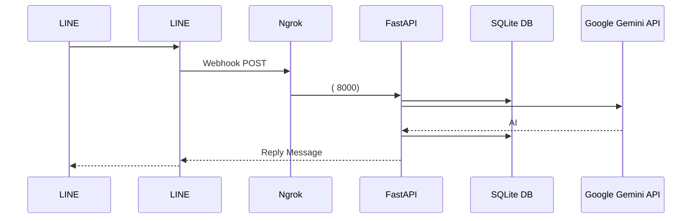

# FastAPI-LINE-Gemini Connector

[](https://www.python.org/downloads/)
[](https://fastapi.tiangolo.com)
[](https://ai.google.dev/)
[](https://opensource.org/licenses/MIT)

Google Gemini AI  LINE Messaging API     ( ) .  FastAPI             .

<p align="center">
    <a href="../README.md">English</a>
    <span>&nbsp;&nbsp;&nbsp;&nbsp;</span>
    <a href="README-TH.md"></a>
    <span>&nbsp;&nbsp;&nbsp;&nbsp;</span>
    <a href="README-ZH.md"></a>
    <span>&nbsp;&nbsp;&nbsp;&nbsp;</span>
    <a href="README-JA.md"></a>
    <span>&nbsp;&nbsp;&nbsp;&nbsp;</span>
    <a href="README-KO.md"></a>
</p>

---

##   (Architecture)



---

##     (Features)
- **    (SQLite):**       .     (`chat_session`)  `sessions.db`  .          .
- **    (Zero-Config Launch):**   (Mac/Linux `run.sh`  Windows `run.bat`)         (Ngrok)  .
- **   (Multimodal):** LINE   ( )    Gemini AI Vision    .
- **Docker   :**           `Dockerfile` `docker-compose.yml`  .

---

##     (Setup)

###  
1. Python  3.9 .
2. **[LINE Messaging API](https://developers.line.biz/console/):** LINE     `Channel Secret`  `Channel Access Token`  .
3. **[Google Gemini API Key](https://aistudio.google.com/):** AI     .
4. **[Ngrok Auth Token](https://dashboard.ngrok.com/):**         .

###   
1.     :
   ```bash
   git clone https://github.com/welltilln/fastapi-line-gemini.git
   cd fastapi-line-gemini
   ```
2.   `.env.example`   `.env`     API   .
3.        :
   - **MacOS / Linux :** `./run.sh`
   - **Windows :** `run.bat`
4.     Ngrok  (: `https://xxxx.ngrok.app/callback`)   LINE Developer  **Webhook URL**    Verify  !

### Docker   
  (VPS)         :
```bash
docker-compose up -d --build
```
*`sessions.db`         .*

---

##    

- **[How Many Cals (AI  )](https://github.com/welltilln/howmanycals)**:         ,      12    AI LINE   .

---

##  AI   (Customization)

- **AI     (Language & Persona):**
        ****  .     `app/gemini.py`    `system_prompt`    ,     .

**    ( AI ):**
```python
system_prompt = """
    AI .
     .
    .
"""
```

**   (  ):**
```python
system_prompt = """
       .
        .             .
"""
```

### AI   (Future-Proofing)
   Gemini (: Gemini 3.0)      ! `app/gemini.py`   `model_name`       .
```python
model = genai.GenerativeModel(
  model_name="gemini-3.0-pro", # <--   
  ...
)
```

---

##    (FAQ)

**Q: Ngrok   2~3      .**
A: Ngrok        2  .       `run.sh`     . ( Docker .)

**Q:        .**
A:       ,   /       .

## 
MIT          .   [LICENSE](../LICENSE)  .
 