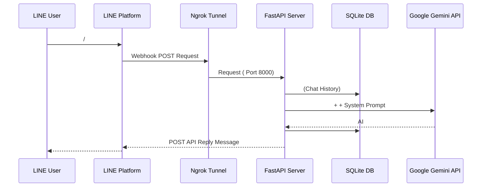

# FastAPI-LINE-Gemini Connector

[](https://www.python.org/downloads/)
[](https://fastapi.tiangolo.com)
[](https://ai.google.dev/)
[](https://opensource.org/licenses/MIT)

 (Boilerplate)  **Google Gemini API**  **LINE Messaging API**  FastAPI   Ngrok Tunnel  Local

<p align="center">
    <a href="../README.md">English</a>
    <span>&nbsp;&nbsp;&nbsp;&nbsp;</span>
    <a href="README-TH.md"></a>
    <span>&nbsp;&nbsp;&nbsp;&nbsp;</span>
    <a href="README-ZH.md"></a>
    <span>&nbsp;&nbsp;&nbsp;&nbsp;</span>
    <a href="README-JA.md"></a>
    <span>&nbsp;&nbsp;&nbsp;&nbsp;</span>
    <a href="README-KO.md"></a>
</p>

---

##  (Architecture)



---

##  (Features)
- ** SQLite (Persistent Session Memory):**  Gemini  `sessions.db`  
- ** (Zero-Config Launch):**  (`run.sh`  Mac/Linux  `run.bat`  Windows)  Virtual Environment,  Dependencies,  FastAPI  Ngrok URL 
- ** (Multimodal):**  (Image Message)  LINE  Gemini  (Image Recognition) 
- ** Docker (Docker Support):**  `Dockerfile`  `docker-compose.yml`  Persistent Volume  VPS 

---

##  (Setup Instructions)

### 
1. Python  3.9 
2.  **[LINE Developers Console](https://developers.line.biz/console/):** `Channel Secret`  `Channel Access Token`
3. **[Google Gemini API Key](https://aistudio.google.com/)** 
4. **[Ngrok Auth Token](https://dashboard.ngrok.com/):** ( Local)

###  (Local Development)

1. :
   ```bash
   git clone https://github.com/welltilln/fastapi-line-gemini.git
   cd fastapi-line-gemini
   ```
2.  `.env.example`  `.env`  API Key  4 
3. :
   - **MacOS / Linux:** `./run.sh`
   - **Windows:** `run.bat`
4.  URL  FastAPI  Ngrok ( `https://xxxx.ngrok.app/callback`)  Webhook URL  LINE Developers  Verify

###  Production (Docker)
 Docker  Ngrok:
```bash
docker-compose up -d --build
```
 (`sessions.db`)  Volume 

---

##  (Examples)

- **[How Many Cals](https://github.com/welltilln/howmanycals)**:  AI 

---

##  (Customization)

- ** (Language & Persona):** 
   ""  `system_prompt`  `app/gemini.py` 

** Prompt :**
```python
system_prompt = """
 AI Assistant 

"""
```

** Prompt :**
```python
system_prompt = """
 "" 
 ""  "" 
 
"""
```

- ** (Bot Logic):**  API   `handle_callback()`  `app/main.py` 

###  AI (Future-Proofing)
 Google  ( Gemini 3.0) !  `app/gemini.py`  `model_name`:
```python
model = genai.GenerativeModel(
  model_name="gemini-3.0-pro", # <-- 
  ...
)
```

---

##  (FAQ)

**Q:  Ngrok  URL   LINE ?**
A:  Ngrok  "" URL   Token  Run.sh ( VPS Server  Docker )

**Q:  Error?**
A:  (Gemini  4MB)  Google API 

##  (License)
 MIT License -  [LICENSE](../LICENSE)
