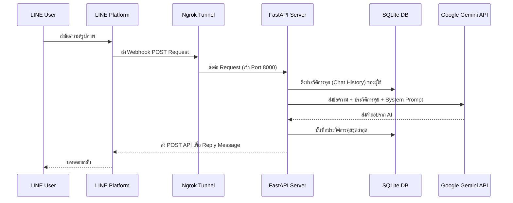

# FastAPI-LINE-Gemini Connector

[](https://www.python.org/downloads/)
[](https://fastapi.tiangolo.com)
[](https://ai.google.dev/)
[](https://opensource.org/licenses/MIT)

ชุดโครงสร้างพื้นฐาน (Boilerplate) สำหรับเชื่อมต่อ **Google Gemini API** เข้ากับ **LINE Messaging API** พัฒนาด้วย FastAPI เน้นความเรียบง่ายและติดตั้งรวดเร็ว พร้อมระบบ Ngrok Tunnel ในตัวสำหรับการรันบนเครื่อง Local

<p align="center">
    <a href="../README.md">English</a>
    <span>&nbsp;&nbsp;•&nbsp;&nbsp;</span>
    <a href="README-TH.md">ภาษาไทย</a>
    <span>&nbsp;&nbsp;•&nbsp;&nbsp;</span>
    <a href="README-ZH.md">简体中文</a>
    <span>&nbsp;&nbsp;•&nbsp;&nbsp;</span>
    <a href="README-JA.md">日本語</a>
    <span>&nbsp;&nbsp;•&nbsp;&nbsp;</span>
    <a href="README-KO.md">한국어</a>
</p>

---

## โครงสร้างสถาปัตยกรรม (Architecture)



---

## ฟีเจอร์หลัก (Features)
- **ระบบความจำ SQLite (Persistent Session Memory):** จัดเก็บประวัติการคุยกับ Gemini ลงใน `sessions.db` อัตโนมัติ ทำให้บอทจำบริบทการคุยได้แม้จะรีสตาร์ทเซิร์ฟเวอร์
- **เริ่มต้นการทำงานในคลิกเดียว (Zero-Config Launch):** สคริปต์ (`run.sh` สำหรับ Mac/Linux และ `run.bat` สำหรับ Windows) จะจัดการเรื่อง Virtual Environment, ติดตั้ง Dependencies, รัน FastAPI และแชร์ Ngrok URL ให้ทันที
- **รองรับข้อความหลายรูปแบบ (Multimodal):** สามารถรับภาพ (Image Message) จาก LINE และส่งให้ Gemini วิเคราะห์ได้ทันที (Image Recognition) 
- **รองรับ Docker (Docker Support):** มีไฟล์ `Dockerfile` และ `docker-compose.yml` พร้อมระบบ Persistent Volume สำหรับนำไปรันบน VPS ได้ทันที

---

## ขั้นตอนการติดตั้ง (Setup Instructions)

### สิ่งที่ต้องเตรียม
1. Python เวอร์ชัน 3.9 ขึ้นไป
2. ข้อมูลจาก **[LINE Developers Console](https://developers.line.biz/console/):** `Channel Secret` และ `Channel Access Token`
3. **[Google Gemini API Key](https://aistudio.google.com/)** 
4. **[Ngrok Auth Token](https://dashboard.ngrok.com/):** (สำหรับรันบนเครื่อง Local)

### การพัฒนาบนเครื่อง (Local Development)

1. ดาวน์โหลดโปรเจค:
   ```bash
   git clone https://github.com/welltilln/fastapi-line-gemini.git
   cd fastapi-line-gemini
   ```
2. แก้ไขไฟล์ `.env.example` เป็น `.env` และใส่ API Key ทั้ง 4 ตัวให้เรียบร้อย
3. รันสคริปต์เริ่มต้น:
   - **MacOS / Linux:** `./run.sh`
   - **Windows:** `run.bat`
4. คัดลอก URL จากเซิร์ฟเวอร์ FastAPI หรือ Ngrok (เช่น `https://xxxx.ngrok.app/callback`) ไปใส่ใน Webhook URL ของหน้า LINE Developers และกด Verify

### การติดตั้งสำหรับ Production (Docker)
ใช้ Docker เพื่อรันเซิร์ฟเวอร์ถาวรโดยไม่ต้องใช้ Ngrok:
```bash
docker-compose up -d --build
```
ฐานข้อมูลประวัติการคุย (`sessions.db`) จะถูกเก็บไว้ใน Volume ภายนอกเพื่อให้ข้อมูลไม่สูญหาย

---

## ตัวอย่างผลงาน (Examples)

- **[How Many Cals](https://github.com/welltilln/howmanycals)**: บอท AI วิเคราะห์รูปภาพอาหารและนับแคลอรี่รวมรายวัน

---

## การปรับแต่ง (Customization)

- **บุคลิกของบอท (Language & Persona):** 
  คุณสามารถกำหนด "ตัวตน" ของบอทได้ที่ตัวแปร `system_prompt` ในไฟล์ `app/gemini.py` 

**ตัวอย่าง Prompt แบบเป็นกันเอง:**
```python
system_prompt = """
คุณคือ AI Assistant ผู้ช่วยส่วนตัวที่น่ารักและเป็นกันเอง

"""
```

**ตัวอย่าง Prompt แบบเป็นทางการ:**
```python
system_prompt = """
คุณคือ "เลขาส่วนตัว" ที่อ้างอิงข้อมูลตามความเป็นจริงและเน้นความสุภาพ
โปรดตอบคำถามโดยใช้สรรพนามว่า "กระผม" และ "ท่าน" เสมอ
 
"""
```

- **ตรรกะของบอท (Bot Logic):** สามารถเปลี่ยนวิธีการรับข้อความหรือเชื่อมต่อ API อื่นๆ เพิ่มเติมได้ที่ฟังก์ชัน `handle_callback()` ในไฟล์ `app/main.py` 

### การอัปเกรดโมเดล AI (Future-Proofing)
หาก Google ปล่อยโมเดลใหม่ (เช่น Gemini 3.0) คุณไม่ต้องเขียนโค้ดใหม่ทั้งหมด! แค่เปิด `app/gemini.py` และเปลี่ยนชื่อใน `model_name`:
```python
model = genai.GenerativeModel(
  model_name="gemini-3.0-pro", # <-- เปลี่ยนตรงนี้
  ...
)
```

---

## คำถามที่พบบ่อย (FAQ)

**Q: ทำไมใช้ Ngrok แล้วเปิดใหม่ URL เปลี่ยน ต้องกดยืนยันใน LINE ใหม่ทุกลำพัง?**
A: ถ้าใช้ Ngrok แบบฟรี "บัญชีชั่วคราว" URL จะเปลี่ยนทุกครั้งที่เปิดใหม่ แนะนำให้สมัครสมาชิกฟรีแล้วใส่ Token ลงใน Run.sh (หรือรันบน VPS Server ด้วย Docker แทน)

**Q: ส่งรูปภาพแล้วบอทไม่ตอบหรือขึ้น Error?**
A: ตรวจสอบขนาดไฟล์ภาพ (Gemini รับได้สูงสุดประมาณ 4MB) หรือเช็คสถานะอินเทอร์เน็ตว่าแอปเชื่อมต่อกับ Google API ได้หรือไม่

## ลิขสิทธิ์ (License)
โปรเจคนี้อยู่ภายใต้ MIT License - ดูรายละเอียดได้ในไฟล์ [LICENSE](../LICENSE)
