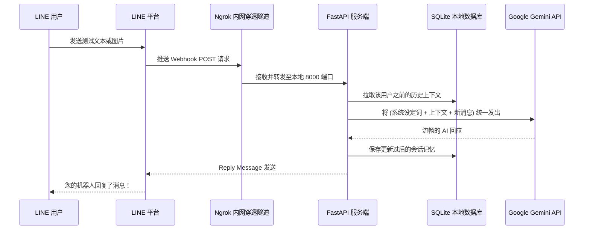

# FastAPI-LINE-Gemini Connector

[](https://www.python.org/downloads/)
[](https://fastapi.tiangolo.com)
[](https://ai.google.dev/)
[](https://opensource.org/licenses/MIT)

一个轻量化、拥有极速开发体验的模板代码库，致力于将 **Google 的 Gemini AI** 无缝整合进 **LINE Messaging API** 中。它基于 FastAPI 构建，不仅简化了极其繁琐的配置挂载流程，内部更是集成了自动化 Ngrok 内网穿透脚本，让您能在分秒间完成原型设计开发。

<p align="center">
    <a href="../README.md">English</a>
    <span>&nbsp;&nbsp;•&nbsp;&nbsp;</span>
    <a href="README-TH.md">ภาษาไทย</a>
    <span>&nbsp;&nbsp;•&nbsp;&nbsp;</span>
    <a href="README-ZH.md">简体中文</a>
    <span>&nbsp;&nbsp;•&nbsp;&nbsp;</span>
    <a href="README-JA.md">日本語</a>
    <span>&nbsp;&nbsp;•&nbsp;&nbsp;</span>
    <a href="README-KO.md">한국어</a>
</p>

---

## 架构数据流图 (Architecture)



---

## 核心特性矩阵 (Features)
- **绝对持久的上下文记忆 (SQLite):** 我们抛弃了那种“重启就全忘光”的低级操作！聊天上下文（`chat_session` 记录）会针对每个用户自动存储在工程环境下的 `sessions.db` 里。就算服务器断电崩溃，重新启动后 AI 依然能接着上一句回复您！
- **零配置，点开即用 (Zero-Config Launch):** 适配各类主流操组系统（Mac/Linux 用 `run.sh`，Windows 用 `run.bat`），它们全自动拉取依赖环境兵启动 Ngrok 会话通道，无需查资料敲命令。
- **天然集成的多模态 (Multimodal):** 代码原生支持提取并转发用户发送的图像 Blob 数据送予极快的 Gemini Vision 层剖析。
- **工业级部署就绪 (Docker Ready):** 自带标准的 `Dockerfile` 及附带了 `sessions.db` 数据卷挂载策略的 `docker-compose.yml`。

---

## 安装配置指南 (Setup Instructions)

### 前置物料
1. 系统必需内置包含 Python 3.9 以上版本。
2. **[LINE Messaging API](https://developers.line.biz/console/):** 必须获得并复制出 `Channel Secret` 和 `Channel Access Token` 备用。
3. **[Google Gemini API Key](https://aistudio.google.com/):** 当前您可以从这里提取出拥有高可用性的大模型专属 Key。
4. **[Ngrok 身份授权令牌](https://dashboard.ngrok.com/):** (如果您必须要在本地计算机上完成整个业务程序的开发)。

### 在本地直接测试系统

1. 将仓库环境拉取到本地硬盘:
   ```bash
   git clone https://github.com/welltilln/fastapi-line-gemini.git
   cd fastapi-line-gemini
   ```
2. 为了安全起见，改名 `.env.example` 这个配置文件为 `.env`。并把刚才拿到的四个 API Keys 对号入座。
3. 把所有的构建工作移交给启动脚本即可:
   - **MacOS 或 Linux 玩家:** `./run.sh`
   - **Windows 用户:** `run.bat`
4. Ngrok 已经在这个时刻启动了映射，请去复制黑色终端框里印出来的专属外网地址（类似于 `https://xxxx.ngrok.app/callback`），将其反向填入到 Line Developer 后台里的 Webhook URL 中大功告成。

### 生产级容器化部署方案 (Docker)
如果要在没有任何域名支持的纯净远程 VPS 上跑:
```bash
docker-compose up -d --build
```
数据卷早已挂载就绪，`sessions.db` 的数据绝不会被清除。

---

## 以此模板拓展的最佳实践专案

- **[How Many Cals (查卡路里机器人)](https://github.com/welltilln/howmanycals)**: 一个拥有视觉分析能力、可精准切分食材、自动随子午线重置卡路里数据库的 LINE 机器人。由这个模板轻松发散重构而来！

---

## 快速定义您的专属智能体 (Customization)

- **修改 AI 语言与人设 (Language & Persona):**
为了包容全球开发者，系统底层的提示词默认配置为 **纯英文**。如果您希望将机器人转化为纯正的中文助手，请立刻打开 `app/gemini.py` 内部提供的 `system_prompt`。将里面的英文提示词删光，并用中文重新赋予它灵魂。

**切换为中文语言样例（标准中文助手）：**
```python
system_prompt = """
你是一位聪明、友好的 AI 智能助手。
从现在开始，无论用户发送什么内容，你都必须 100% 使用流利的「简体中文」与用户交流。
请保持文案生动且专业。
"""
```

**定制特殊人设样例（粗暴的翻译机器）：**
```python
system_prompt = """
你是一位顶尖的语言学翻译专家。
从现在开始，无论用户向你发送哪种语言的文字，哪怕是乱码和俚语。
你都必须以最高的质量、最通顺的语气将其翻译成「简体中文」。
只需输出翻译过后的文本，绝对禁止做任何额外的寒暄与多余的解释！
"""
```

### 升级大语言模型 (Future-Proofing)
如果在未来发布了更强大的模型（比如 Gemini 3.0），您完全不需要重写代码！只需打开 `app/gemini.py`，并将 `model_name` 字段更改为最新的模型名称即可：
```python
model = genai.GenerativeModel(
  model_name="gemini-3.0-pro", # <-- 更新此行参数
  ...
)
```

---

## 常见疑难解答 (FAQ)

**Q: 为什么离开电脑去喝杯咖啡回来，我的 LINE 机器人就不回复我了？**
A: 全体起立关注这里！如果您使用的是 Ngrok 【免费无充值档】，官方设定只要挂机空闲长达 2 个小时没有请求连接就会强制杀掉会话，直接导致您的 Webhook 失效！关闭终端，重跑一次 `run.sh` 即可重获新生。

**Q: Docker 内的依赖更新怎么办？**
A: 只要您更新了 `requirements.txt`。请务必停止老容器，接着带上长参数 `docker-compose up -d --build` 进行深度重新编译即可。

## 开源协议许可
所有代码基于自由化程度顶尖的 MIT License 证书开源，全文档及解释权详见 [LICENSE](../LICENSE) 证书。
