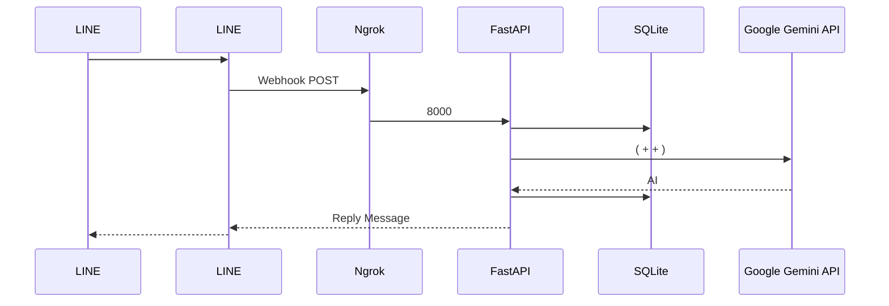

# FastAPI-LINE-Gemini Connector

[](https://www.python.org/downloads/)
[](https://fastapi.tiangolo.com)
[](https://ai.google.dev/)
[](https://opensource.org/licenses/MIT)

 **Google  Gemini AI**  **LINE Messaging API**  FastAPI  Ngrok 

<p align="center">
    <a href="../README.md"></a>
    <a href="README-TH.md"></a>
    <a href="README-ZH.md"></a>
    <a href="README-JA.md"></a>
    <a href="README-KO.md"></a>
</p>

---

##  (Architecture)



---

##  (Features)
- ** (SQLite):** `chat_session`  `sessions.db`  AI 
- ** (Zero-Config Launch):** Mac/Linux  `run.sh`Windows  `run.bat` Ngrok 
- ** (Multimodal):**  Blob  Gemini Vision 
- ** (Docker Ready):**  `Dockerfile`  `sessions.db`  `docker-compose.yml`

---

##  (Setup Instructions)

### 
1.  Python 3.9 
2. **[LINE Messaging API](https://developers.line.biz/console/):**  `Channel Secret`  `Channel Access Token` 
3. **[Google Gemini API Key](https://aistudio.google.com/):**  Key
4. **[Ngrok ](https://dashboard.ngrok.com/):** ()

### 

1. :
   ```bash
   git clone https://github.com/welltilln/fastapi-line-gemini.git
   cd fastapi-line-gemini
   ```
2.  `.env.example`  `.env` API Keys 
3. :
   - **MacOS  Linux :** `./run.sh`
   - **Windows :** `run.bat`
4. Ngrok  `https://xxxx.ngrok.app/callback` Line Developer  Webhook URL 

###  (Docker)
 VPS :
```bash
docker-compose up -d --build
```
`sessions.db` 

---

## 

- **[How Many Cals ()](https://github.com/welltilln/howmanycals)**:  LINE 

---

##  (Customization)

- ** AI  (Language & Persona):**
 **** `app/gemini.py`  `system_prompt`

****
```python
system_prompt = """
 AI 
 100% 

"""
```

****
```python
system_prompt = """


"""
```

###  (Future-Proofing)
 Gemini 3.0 `app/gemini.py` `model_name` 
```python
model = genai.GenerativeModel(
  model_name="gemini-3.0-pro", # <-- 
  ...
)
```

---

##  (FAQ)

**Q:  LINE **
A:  Ngrok  2  Webhook  `run.sh` 

**Q: Docker **
A:  `requirements.txt` `docker-compose up -d --build` 

## 
 MIT License  [LICENSE](../LICENSE) 
